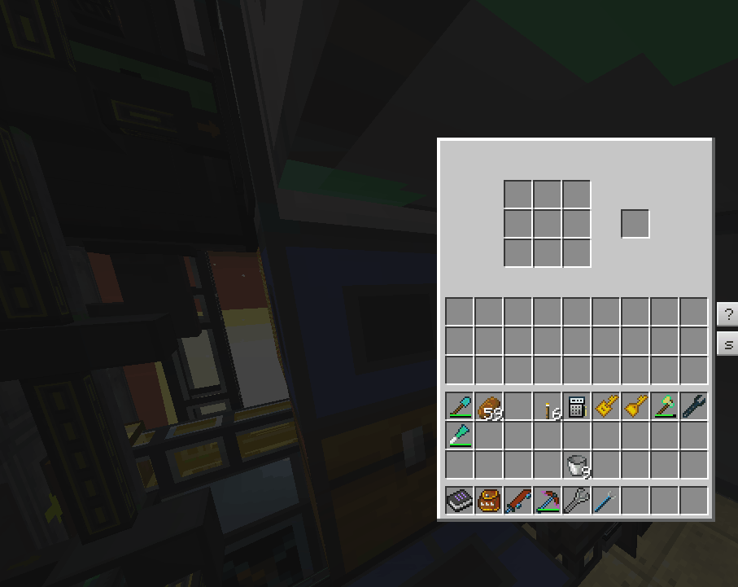

# OCRemote
OCRemote is an OpenComputers program by cyb0124 for item management and auto-crafting. Main features include:
  - Extensive reuse of same machines for multiple recipes.
  - Prioritization of recipes based on the current number of items stored. (e.g. deciding which crop to grow, or deciding which ore to process first.)
  - Robust handling of multiple-input recipes to prevent clogging (e.g. for alloy furnaces).
  - Preventing recipes from using up the last seed/sapling/etc.

OCRemote is designed for survival/expert-mode gameplay in modpacks such as Enigmatica 2 and Project Ozone 3. When used correctly, it can completely replace ME-system based auto processing both in early game and in late game. It has been tested to function correctly in Sponge-based public servers.

## Server and clients
OCRemote includes a TCP server program written in C++ that needs be run outside the minecraft world. All decision-makings happen in the server. The computers in minecraft world merely execute the commands sent by the server. Multiple clients can connect to the same server, which allows parallelization of inventory manipulation operations.

## Bus
OCRemote requires a shared inventory to move items around. This inventory is called as the "bus" in the source code. The bus can be implemented using EnderStorage's ender chests, or using ActuallyAdditions' item lasers.\

## Storage
OCRemote currently supports 3 different types of storages:
  - **Chests**\
    OCRemote will use chests the most efficient way, i.e. coalescing item stacks to avoid wasting slots.
  - **StorageDrawers** or equivalent.
  - **ME system**\
    OpenComputers' access to ME system is slow (throttled), so OCRemote is able to use multiple computers to access the same ME system to parallelize accesses.

## Auto Crafting
OCRemote doesn't analyze any tree structure for recipe dependencies; instead it will simply start to craft an item if the amount stored of that item falls below a set point and if all ingredients are available. This will eventually propagate through all recipe dependencies. If multiple recipes use the same machine, OCRemote will prefer the recipe with the lowest percentage amount stored. All processes can also regulate the amount of items in the machine buffer to prevent bloating the machine buffers. OCRemote currently supports the following types of auto-crafting processes:
  - **ProcessSlotted**\
    This process is intended for machines that can only run 1 recipe at once and the input items need to go into specific slot with the correct ratio. OCRemote will only execute recipes that input items match the items already in the machine.
  - **ProcessCraftingRobot**\
    This process uses a single crafting robot to handle all grid crafting recipes. It also allows non-consumable items in recipes (e.g. Pam's Harvestcraft recipes that require utensils, or master infusion crystal).
  - **ProcessRFToolsControlWorkbench**\
    Same as ProcessCraftingRobot, but uses RFTools Control's Workbench as the crafter. In this case, non-consumable items are stored in a neighboring inventory.\
    
  - **ProcessBuffered**\
    This process is intended for machines that can run multiple recipes at once, or for general buffering/pipelining of recipe inputs. In additional to recipes, it also allows items to be constantly refilled at the target inventory. Besides being able to regulate the total amount of items in the buffer, it also allows limiting each individual recipe's maximum number of items being processed. This process respects the ratio of the input items and only sends complete sets of inputs, which is useful for machines such as ExCompressum's Auto Compressor, or gear presses.
  - **ProcessScatteringWorkingSet**\
    This process is intended for machine that can run multiple recipes at once but independently for each slot. This process will try to spread out input items among slots to help with parallelization.
  - **ProcessInputless** and **ProcessHeterogeneousInputless**\
    These processes are for machines that passively generate outputs (e.g. cobblestone generators).
  - **ProcessReactorHysteresis**\
    This process is a simple hysteresis feedback controller for big/extreme reactors.
  - **ProcessReactorProportional**\
    This process is a simple proportional feedback controller for big/extreme reactors.
  - **ProcessPlasticMixer**\
    This process automatically sets PneumaticCraft's plastic mixer's color setting to produce the plastic that has the lowest amount stored. 

## Usage
The documentation is still WIP and there isn't a GUI for configuration yet. The storage/auto-crafting configuration is currently hardcoded in the [server program's main function](server/OCServer/Entry.cpp). It contains a sample configuration which you can adapt for your own use. To use OCRemote, you need to build and run the [server program](server/OCServer) on a server that can be reached from OpenComputers' Internet Card. The server requires a C++ compiler (e.g. gcc) with C++17 support, [CMake](https://cmake.org/) and [Boost](https://www.boost.org/) to build. For the [client script](client/client.lua), you need to edit the first 3 lines to match your server configuration. The client script is meant to run without any OS or storage medium. To run it, first compress it using [Lua minifier](https://mothereff.in/lua-minifier) and then flash it into an EEPROM. Alternatively, you can upload the client script to a HTTP server and flash the [loader script](client/loader.lua) to load the uncompressed client script from the Internet.
