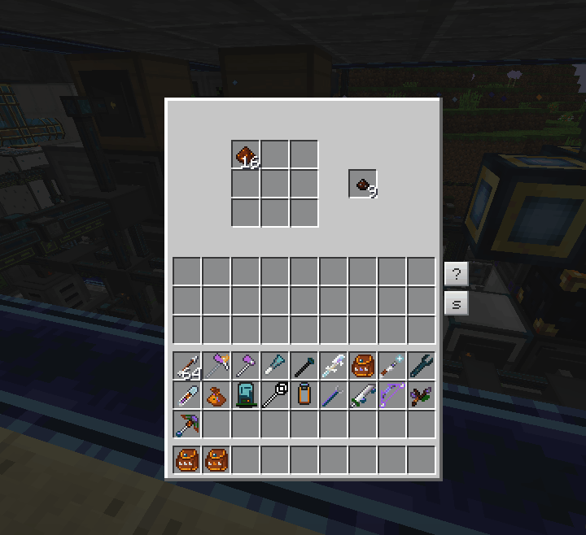
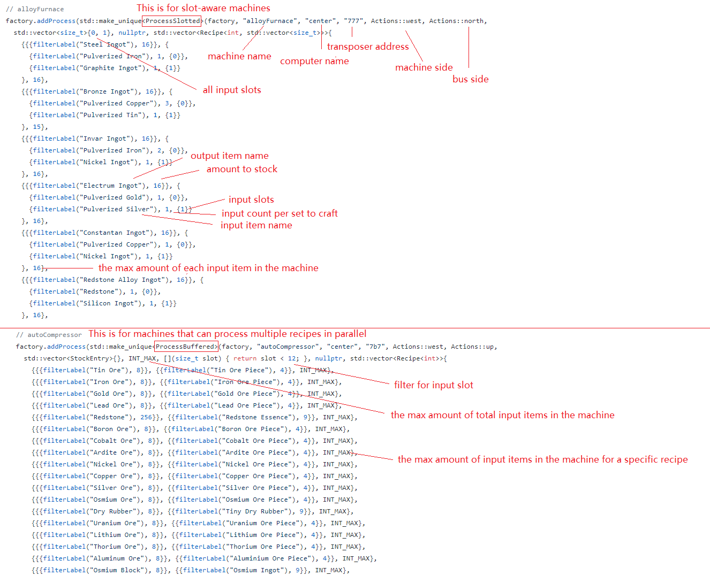

# OCRemote
OCRemote is a ComputerCraft/OpenComputers system for item-storage and multi-step parallelized automations. It allows you to build a network of storages and machines similar to an ME system. It is designed to handle heavy automation workloads seen in expert-mode modpacks.

Main features:
  - User doesn't request crafting from this system. Instead, all craftable items are kept a constant stock of.
  - All input/output/crafting rules are configured as code. This allows extremely compact setups, such as defining 100+ recipes for a single machine, and specifying input, output and crafting all on the same side of a machine.
  - Robust handling of many types of automations, from simple ore-processing to complex multi-block/in-world crafting that requires you to send inputs in the exact amount/proportion to different locations like [this](https://www.youtube.com/watch?v=HKk70owisso). Items in machine buffers can also be precisely regulated: no clogging should ever happen.
  - Prioritization of recipes based on demand. (e.g. deciding which ore to process first).
  - Compressing items for storage, and unpacking them before processing.
  - Preventing recipes from using up the last seed/sapling items.
  - Allow defining rules to process/discard excessive items (e.g. saplings from tree farm).
  - Multiple computers can be used to parallelize item-transfer, achieving more than 1 stack per tick of throughput.

Please watch the [Demo Video](https://www.youtube.com/watch?v=Llr-lM0pIME) for an overview.

## Server, Clients and the Asynchronous Architecture
OCRemote includes a TCP server program running outside Minecraft. All decision-makings happen in the server. The computers in minecraft world connect to the server as clients to execute world-interaction tasks scheduled by the server. Multiple clients can connect to the same server to parallelize task execution and balance the load. In OCRemote, crafting processes can be interleaved with each other. For example, when a process starts, it needs to send a task to a computer to query the inventory of the machine, and wait for the response. Then, it needs to allocate some temporary storage space for transporting items to the machine, and if none is available, add itself to a wait-queue so that it can be resumed when space becomes available. During the waiting, other computers tasked by other processes could have moved items in and out of the storages, or transported items between machines. The design of OCRemote's server makes sure race conditions caused by reentrance are correctly handled so that no inconsistency could be caused by the asynchronous process execution.

Note: it is safe to terminate the server at any time. However, it is not safe to shutdown the computer in Minecraft while the server is running, as it may cause incomplete set of input items to be sent to machines.

## Bus
OCRemote requires a shared inventory to temporarily hold items for transferring. This inventory is called as the "bus" in the source code.\

## Storage
OCRemote currently supports 3 different types of storages:
  - **Chests** or equivalent\
    OCRemote will use chests the most efficient way, i.e. coalescing item stacks to avoid wasting slots.
  - **StorageDrawers** or equivalent\
    Note: drawers should always be locked. You should not change drawer layout (e.g. placing down a new drawer, removing a drawer or inserting a new type of item) while OCRemote is running.
  - **ME system** (OpenComputers only)\
    OpenComputers' access to ME system is slow (throttled), so OCRemote is able to use multiple computers to access the same ME system to parallelize accesses.

## Auto Crafting
OCRemote doesn't analyze any tree structure for recipe dependencies; instead it will simply start to craft an item if the amount stored of that item falls below a set point and if all ingredients are available. This will eventually propagate through all recipe dependencies. If multiple recipes use the same machine, OCRemote will prefer the recipe with the lowest percentage amount stored. All processes can also regulate the amount of items in the machine buffer to prevent bloating the machine buffers. OCRemote currently supports the following types of auto-crafting processes:
  - **Slotted**\
    This process is intended for machines that can only run 1 recipe at once and the input items need to go into specific slot with the correct ratio. If there are already items in the machine, OCRemote will only send additional inputs that match the in-progress recipe.
  - **CraftingRobot**\
    This process uses robots to handle all crafting-grid recipes. It also allows non-consumable items in recipes (e.g. Pam's Harvestcraft recipes that require cookwares, or master infusion crystal). Multiple robots can be used for parallelization.
  - **RFToolsControlWorkbench**\
    Same as CraftingRobot process, but uses RFTools Control's Workbench as the crafter. In this case, non-consumable items are stored in a neighboring inventory.\
    
  - **Buffered**\
    This process is intended for machines that can run multiple recipes at once, or for general buffering/pipelining of recipe inputs. In additional to recipes, it also allows items to be constantly refilled at the target inventory. This process can both regulate the total amount of items in the buffer, and limit each individual recipe's maximum number of items being processed. This process respects the ratio of the input items and only sends complete sets of inputs, which is useful for machines such as auto-compressors or gear presses.\
    
  - **MultiInvSlotted**\
    This process allows you to send complete sets of inputs to multiple locations and wait for crafting to finish before sending new inputs. Here are some examples:
    - Automating all crafting-grid recipes using a single mechanical crafter ([video](https://www.youtube.com/watch?v=HKk70owisso))
    - Automating flux dust ([video](https://www.youtube.com/watch?v=OiZdN3g2Ddc))
    - Automating runic altar ([video](https://www.youtube.com/watch?v=Tgx_kLvESxo))
    - Automating lightning crafting ([video](https://www.youtube.com/watch?v=dX8pQmfp4FQ))
  - **Scattering**\
    This process is intended for machine that can run multiple recipes at once but independently for each slot (e.g. Mekanism factory). This process will try to spread out input items among slots to help with parallelization.
  - **Inputless**\
    This process handles machines that passively generate outputs (e.g. cobblestone generators).
  - **RedstoneConditional**\
    This process conditionally executes another process based on a redstone signal. This is useful for crafting processes that require items to be dropped on the ground (e.g. terrasteel crafting and Sky Resources 2 combustion). In these cases, redstone can be used to detect the number of items already on the ground to prevent dropping excessive inputs.
  - **RedstoneEmitter**\
    This process emits a redstone signal from user-defined rules. It can be used to turn on/off machines based on the amount of items stored.
  - **ItemCycle**\
    This process cycles through sending different items to an inventory. This allows automating Gourmaryllis with just one dropper.
  - **LowAlert**\
    This process prints messages on the screen if the stored amount of specified items is low.
  - **ReactorHysteresis**/**ReactorProportional**/**ProcessReactorPID** (OpenComputers only)\
    Hysteresis/proportional/PID feedback controller for big/extreme reactors.
    These processes can also force the reactor to max output if cyanite stored is low.
  - **PlasticMixer** (OpenComputers only)\
    This process automatically sets PneumaticCraft's plastic mixer's color setting to produce the plastic that has the lowest amount stored.
  - **FluxNetwork** (OpenComputers only)\
    This process reads the energy level of a FluxNetwork and emits redstone signal based on user-defined rules.
  - **SyncAndRestock** (ComputerCraft only)\
    This process extracts or restocks an inventory upon receiving a request via redstone, and sends out a completion signal upon finishing the request. It is mainly used to dock and restock moving structures from the Create mod.

## Usage for OpenComputers
The storage/auto-crafting configuration is a part of the server program [here](server/RustImpl/src/config.rs). It contains a sample configuration which you can adapt for your own use. To use OCRemote, you need to build and run the [server program](server/RustImpl) on a server that can be reached from OpenComputers' Internet Card. The server requires a [Rust nightly toolchain](https://rustup.rs/) to build. To setup the computers in Minecraft, edit the last line of the [loader script](client/loader.lua) and flash it to an EEPROM (the computers are meant to run without any OS or storage medium). The last line of the loader script specifies the server address, server port, client name and the screen resolution.

The following image shows how common recipes are specified.\

## Usage for ComputerCraft
The code for ComputerCraft is in another repository [here](https://github.com/cyb0124/CCRemote). The procedure is similar to OpenComputers, but instead of flashing the loader script to an EEPROM, put it in a file named `startup`.

### Old C++ Version
The server program was originally developed in C++ and later rewritten in Rust. The old C++ version is still included in the repository [here](server/CPPImpl) and available for use, but is no longer maintained and lacks some features.
