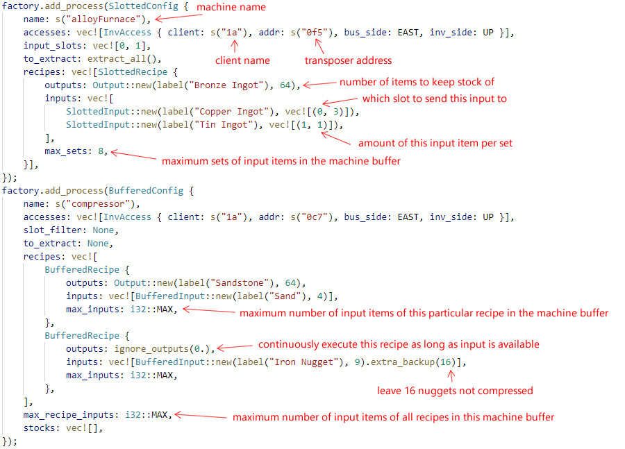

# OCRemote
OCRemote is a ComputerCraft/OpenComputers system for item-storage and multi-step parallelized automations. It allows you to build a network of storages and machines similar to an ME system. It is designed to handle heavy automation workloads seen in expert-mode modpacks.

Main features:
  - User doesn't request crafting from this system. Instead, all craftable items are kept a constant stock of.
  - All input/output/crafting rules are configured as code. This allows extremely compact setups, such as defining 100+ recipes for a single machine, and specifying input, output and crafting all on the same side of a machine.
  - Robust handling of many types of automations, from simple ore-processing to complex multi-block/in-world crafting that requires you to send inputs in the exact amount/proportion to different locations like [this](https://www.youtube.com/watch?v=HKk70owisso). Items in machine buffers can also be precisely regulated: no clogging should ever happen.
  - Prioritization of recipes based on demand. (e.g. deciding which ore to process first).
  - Compressing items for storage, and unpacking them before processing.
  - Preventing recipes from using up the last seed/sapling items.
  - Allow defining rules to process/discard excessive items (e.g. saplings from tree farm).
  - Multiple computers can be used to parallelize item-transfer, achieving more than 1 stack per tick of throughput.

Please watch the [Demo Video](https://www.youtube.com/watch?v=Llr-lM0pIME) for an overview.

## Server, Clients and the Asynchronous Architecture
OCRemote includes a TCP server program written in C++ running outside the Minecraft world. All decision-makings happen in the server. The computers in minecraft world connect to the server as clients to execute world-interaction tasks scheduled by the server. Multiple clients can connect to the same server to parallelize task execution and balance the load. In OCRemote, crafting processes can be interleaved with each other. For example, when a process starts, it needs to send a task to a computer to query the inventory of the machine, and wait for the response. Then, it needs to allocate some temporary storage space for transporting items to the machine, and if none is available, add itself to a wait-queue so that it can be resumed when space becomes available. During the waiting, other computers tasked by other processes could have moved items in and out of the storages, or transported items between machines. The design of OCRemote's server makes sure race conditions caused by reentrance are correctly handled so that no inconsistency could be caused by the asynchronous process execution.

Note: it is safe to terminate the server at any time. However, it is not safe to shutdown the computer in Minecraft while the server is running, as it may cause incomplete set of input items to be sent to machines.

## Bus
OCRemote requires a shared inventory to temporarily hold items for transferring. This inventory is called as the "bus" in the source code.\

## Storage
OCRemote currently supports 3 different types of storages:
  - **Chests**\
    OCRemote will use chests the most efficient way, i.e. coalescing item stacks to avoid wasting slots.
  - **StorageDrawers** or equivalent.\
    Note: drawers should always be locked. You should not change drawer layout (e.g. placing down a new drawer, removing a drawer or inserting a new type of item) when OCRemote is running.
  - **ME system** (only for OpenComputers)\
    OpenComputers' access to ME system is slow (throttled), so OCRemote is able to use multiple computers to access the same ME system to parallelize accesses.

## Auto Crafting
OCRemote doesn't analyze any tree structure for recipe dependencies; instead it will simply start to craft an item if the amount stored of that item falls below a set point and if all ingredients are available. This will eventually propagate through all recipe dependencies. If multiple recipes use the same machine, OCRemote will prefer the recipe with the lowest percentage amount stored. All processes can also regulate the amount of items in the machine buffer to prevent bloating the machine buffers. OCRemote currently supports the following types of auto-crafting processes:
  - **ProcessSlotted**\
    This process is intended for machines that can only run 1 recipe at once and the input items need to go into specific slot with the correct ratio. OCRemote will only execute recipes that input items match the items already in the machine.
  - **ProcessCraftingRobot**\
    This process uses robots to handle all grid crafting recipes. It also allows non-consumable items in recipes (e.g. Pam's Harvestcraft recipes that require cookwares, or master infusion crystal). Multiple robots can be used for parallelization.
  - **ProcessRFToolsControlWorkbench**\
    Same as ProcessCraftingRobot, but uses RFTools Control's Workbench as the crafter. In this case, non-consumable items are stored in a neighboring inventory.\
    
  - **ProcessBuffered**\
    This process is intended for machines that can run multiple recipes at once, or for general buffering/pipelining of recipe inputs. In additional to recipes, it also allows items to be constantly refilled at the target inventory. This process can both regulate the total amount of items in the buffer, and limit each individual recipe's maximum number of items being processed. This process respects the ratio of the input items and only sends complete sets of inputs, which is useful for machines such as ExCompressum's Auto Compressor, or gear presses.
    
  - **ProcessScatteringWorkingSet**\
    This process is intended for machine that can run multiple recipes at once but independently for each slot. This process will try to spread out input items among slots to help with parallelization.
  - **ProcessInputless**\
    This process handles machines that passively generate outputs (e.g. cobblestone generators).
  - **ProcessReactorHysteresis**\
    This process is a simple hysteresis feedback controller for big/extreme reactors.
  - **ProcessReactorProportional**\
    This process is a simple proportional feedback controller for big/extreme reactors.
  - **ProcessReactorPID**\
    This process is a PID controller for big/extreme reactors.
    All the reactor processes above can force the reactor to max output if cyanite stored is low.
  - **ProcessPlasticMixer**\
    This process automatically sets PneumaticCraft's plastic mixer's color setting to produce the plastic that has the lowest amount stored. 
  - **ProcessRedstoneConditional**\
    This process conditionally executes another process based on a redstone signal. This is useful for crafting processes that require items to be dropped on the ground (e.g. terrasteel crafting and Sky Resources 2 combustion). In these cases, redstone can be used to detect the number of items already on the ground to prevent dropping excessive inputs.
  - **ProcessRedstoneEmitter**\
    This process emits a redstone signal from on a callback function. It can be used to turn on/off machines based on the amount of items stored.
  - **ProcessFluxNetwork**\
    This process reads the energy level of a FluxNetwork and emits redstone signal based on the energy level, with rules specified by callback functions.

## Usage
The storage/auto-crafting configuration is currently hardcoded in the [server program's main function](server/CPPImpl/Entry.cpp). It contains a sample configuration which you can adapt for your own use. To use OCRemote, you need to build and run the [server program](server/CPPImpl) on a server that can be reached from OpenComputers' Internet Card. The server requires a C++ compiler (e.g. gcc) with C++17 support, [CMake](https://cmake.org/) and [Boost](https://www.boost.org/) to build. For the [client script](client/client.lua), you need to replace the `...` in the first line with your own configuration (`resX` and `resY` are the screen resolutions). The client script is meant to run without any OS or storage medium. To run it, first compress it using [Lua minifier](https://mothereff.in/lua-minifier) and then flash it into an EEPROM. Alternatively, you can flash the [loader script](client/loader.lua) to load the uncompressed client script from the Internet.

The following image explains how common recipes are specified.

### Rust Rewrite
The server has been rewritten in Rust, which should be easier to build and run. See [example configuration](server/RustImpl/src/config.rs) for details.

### ComputerCraft Port
Code in this repository is for OpenComputers. For ComputerCraft, please go to [here](https://github.com/cyb0124/CCRemote).

CCRemote provides some extra processes to make automating with multi-blocks or in-world interactions easier:
  - **SyncAndRestockProcess**\
    This process extracts or restocks an inventory upon receiving a request via redstone, and sends out a completion signal upon finishing the request. It is mainly used to dock and restock moving structures from the Create mod.
  - **ItemCycleProcess**\
    This process cycles through sending different items to an inventory. This allows automating Gourmaryllis with just one dropper.
  - **MultiInvSlottedProcess**\
    This process allows you to send complete sets of inputs to multiple locations and wait for crafting to finish before sending new inputs. Here are some examples:
    - Automating all crafting-grid recipes using a single mechanical crafter ([video](https://www.youtube.com/watch?v=HKk70owisso))
    - Automating flux dust ([video](https://www.youtube.com/watch?v=OiZdN3g2Ddc))
    - Automating runic altar ([video](https://www.youtube.com/watch?v=Tgx_kLvESxo))
    - Automating lightning crafting ([video](https://www.youtube.com/watch?v=dX8pQmfp4FQ))
